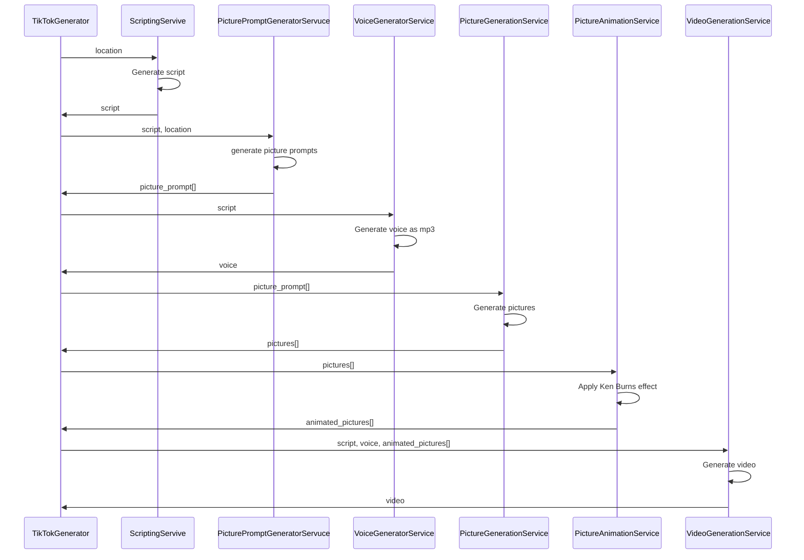
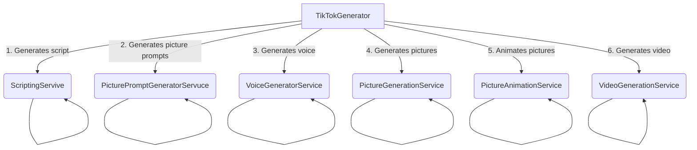
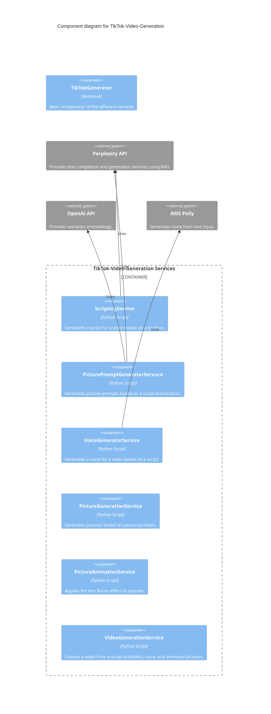

# tiktok-video-generation

This repository contains the code for our Introduction to AI project. The project is about generating TikTok videos using a combination of different generative AI models.

## Getting started

To set up the project, follow these steps:

1. Clone the repository
2. Create a new Conda environement based on the documented dependencies `conda env create --file environment.yml`
3. Activate the Conda environment `conda activate cmuintroaiproject`

Add new dependencies using `conda install <package>` and update the `environment.yml` file using `conda env export --name cmuintroaiproject > environment.yml`.

4. Add environment variables to the `.env` file. You can use the `.env.example` file as a template.

## Running the project

To run the project, execute the following command:

```bash
python main.py
```

## Project Structure

The project is structured as follows:

```plaintext
.
├── Dockerfile                      # Dockerfile for the project
├── README.md                       # This file
├── .env                            # Environment variables
├── environment.yml                 # Conda environment file
├── main.py                         # Main file to run the project
└── services                        # Services for the project
    ├── scripting_service.py
    └── voice_generator_service.py
```


## Architecture

The video different components are generated step-by-step:




The TikTokGenerator (residing in a notebook) is thus the main orchestrator of the different services.:




The different services rely on some external components for which API-Keys need to be configured in the `.env` file:

